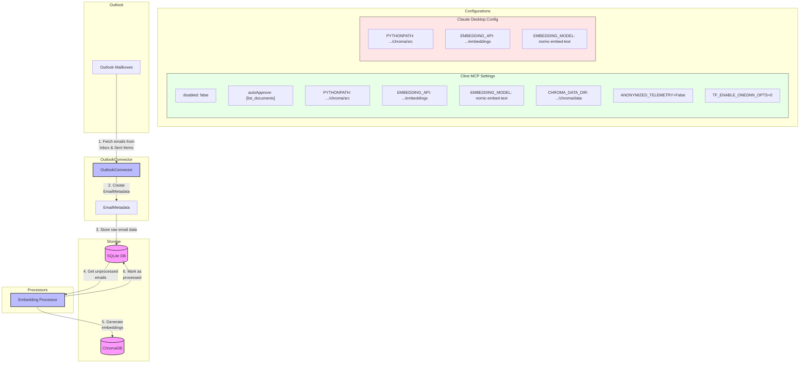

```mermaid
flowchart TD
    subgraph Configs[Configurations]
        subgraph Cline[Cline MCP Settings]
            style Cline fill:#e6ffe6,stroke:#333
            C1["disabled: false"]
            C2["autoApprove: [list_documents]"]
            C3["PYTHONPATH: .../chroma/src"]
            C4["EMBEDDING_API: .../embeddings"]
            C5["EMBEDDING_MODEL: nomic-embed-text"]
            C6["CHROMA_DATA_DIR: .../chroma/data"]
            C7["ANONYMIZED_TELEMETRY=False"]
            C8["TF_ENABLE_ONEDNN_OPTS=0"]
        end

        subgraph Claude[Claude Desktop Config]
            style Claude fill:#ffe6e6,stroke:#333
            D1["PYTHONPATH: .../chroma/src"]
            D2["EMBEDDING_API: .../embeddings"]
            D3["EMBEDDING_MODEL: nomic-embed-text"]
        end
    end

    subgraph Outlook
        O[Outlook Mailboxes]
    end

    subgraph OutlookConnector
        OC[OutlookConnector]
        EM[EmailMetadata]
    end

    subgraph Storage
        SQ[(SQLite DB)]
        CD[(ChromaDB)]
    end

    subgraph Processors
        EP[Embedding Processor]
    end

    O -->|1. Fetch emails from\nInbox & Sent Items| OC
    OC -->|2. Create\nEmailMetadata| EM
    EM -->|3. Store raw email data| SQ
    SQ -->|4. Get unprocessed\nemails| EP
    EP -->|5. Generate\nembeddings| CD
    EP -->|6. Mark as\nprocessed| SQ

    classDef database fill:#f9f,stroke:#333,stroke-width:2px
    classDef process fill:#bbf,stroke:#333,stroke-width:2px
    class SQ,CD database
    class OC,EP process
```
